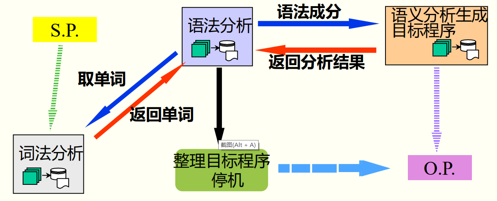
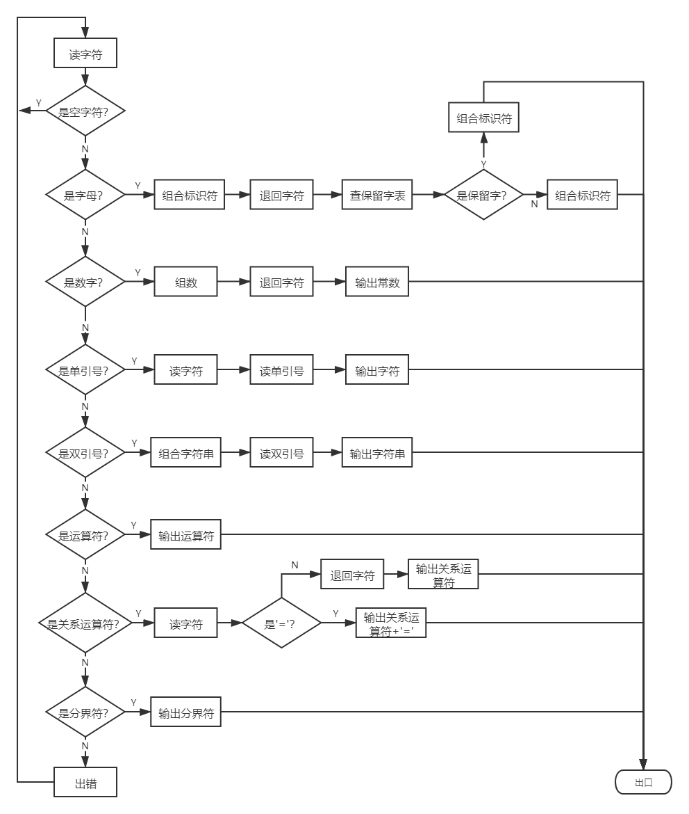

# BUAA编译技术课程设计申优文档

[TOC]

## 1. 前言

​		本项目是基于[C0文法](https://github.com/NickHan-cs/Compiler/blob/main/docs/origin_grammar.txt)实现的编译器，可以将类C语言的源程序编译成相应的mips汇编语言的程序，现已开源到[github](https://github.com/NickHan-cs/Compiler)上。

​		编译技术课程设计是一门自由、自主的课程设计，简单来说，我们的任务就是从一无所有到一个能实现编译过程的简单编译器。我们需要自己设计整个项目的架构和接口，而且在中间实现的过程中，既要便于前端程序的调用，也要考虑后端部分的实现，较为复杂，当然这个漫长的过程也教会了笔者许多搭建工程项目的思想和方法。

​		本项目有4000余行代码，是第一个由笔者设计并实现的中型项目。整个项目从最初的设计到后来的实现（甚至是中间的重构）各个环节上，应该说利用到了许多之前课程学习的内容。无论是在《计算机组成》课程中常常提到的“高内聚低耦合”的思想，还是在《面向对象设计与构造》课程中学到的“面向对象”程序设计的方法，抑或是在《数据结构》课程中打下的基本数据结构的基础，都在我实现这个编译器的过程中发挥了很大的作用。因此在这里，除了要感谢编译技术理论课和助教的指导，也要感谢之前相关课程老师和助教的辛勤付出。

​		该编译器采用C++语言实现，但笔者先前没有C++开发的经验，熟悉C++的编程技巧和语言特性就成为了在具体实现时很重要的一环。C++算是一种古老的编程语言，但是在C++11中已经包括了许多现代语言的特性，例如STL标准模板库，它已经实现了许多容器和算法（免于重复造轮子），利用好这些特性可以大大地提到变成效率和质量。学习一门语言最好的方法就是阅读他人的优秀代码和参考文档，这里推荐[cppreference](https://en.cppreference.com/w/)、[C++教程](http://c.biancheng.net/cplus/)和[STL教程](http://c.biancheng.net/stl/)作为参考手册。

​		该文档是对如何实现整个编译器的总结，包括在实现过程中遇到的各个困难点及所采用的解决方法的简要阐述，详细的设计文档可以参考[CompilerDocs](https://github.com/NickHan-cs/Compiler/tree/main/docs)，其包括：

* 词法分析设计文档
* 语法分析设计文档
* 错误处理设计文档
* 代码生成设计文档
* 优化设计文档

​		这两万余词的设计文档（其中包括了12000+词的代码生成设计文档）详细地记录了笔者开发这个编译器的过程。

## 2. 整体架构

​		编译器必须完成两个主要任务：一是对源程序的分析，二是生成目标程序。分析部分（前端）是将源程序分解为各语言的各个基本语法成分，生成与其相等价的源代码的中间形式。通常将分析程序划分为**词法分析**、**语法分析**和**语义分析**三个阶段。前端也包括完成相应部分的错误处理和符号操作等工作。综合部分（后端）接受分析部分产生的中间代码，然后根据具体的目标机系统生成目标代码，并对代码进行优化处理。一般将综合部分分为**目标代码生成**和**代码优化**两个阶段。

​		编译器的主要架构可以参考“一遍扫描的编译程序”，如下图所示。



​		一遍扫描的编译程序以语法分析过程为核心，当语法分析程序需要读进一个新的单词符号，它就调用词法分析程序。词法分析程序从源程序中依次读进字符，并组合成单词符号返回给语法分析程序。当语法分析识别出某一语法成分时，它就调用语义分析和代码生成程序进行分析并生成目标程序。

​		一遍扫描的编译程序的优点是编译速度快，但是缺点在于不便于优化。因此，本项目的**整体架构**是将编译前端作为一遍，即词法分析、语法语义分析及中间代码生成合并在一遍中进行（具体的控制流程和一遍扫描的编译程序相同）；而编译后端，即代码生成和代码优化单独作为另一遍。当代码优化要求很高时，各种优化技术就可能要安排两遍或多遍来完成。

## 3. 词法分析

​		词法分析作为语法分析程序调用的子程序实现，其目的是将字符串形式的源程序分解为具有独立语法意义的单词符号`token`，可以参考词法分析设计文档中的PL/0编译器的词法分析程序`getsym`。

​		本项目首先根据单词的词法规则画出，然后根据**状态图**来构造词法分析程序。关于状态图的画法和使用可以参考《编译技术》（高等教育出版社，张莉、史晓华、杨海燕、金茂忠编著）3.3节“正则文法及其状态图”。有了状态图，只要进一步把语义动作添加到状态图中，并使每一个状态都对应一小段程序，就可得到词法分析程序的算法框图。本项目词法分析程序的算法框图如下所示。



​		在具体实现上，

* 可以采用C++标准库`fstream`实现从文件读取流；
* 最初设计的状态机是NFA状态机，因为读到的字符可能处于多个状态的FIRST集合，我们可以通过预读下一个字符，来确定要转移的字符，因此也要注意回退
* 建议将`token`封装成一个类，可以记录`token`的类型、内容和所在的行号等内容，便于语法分析程序的调用和错误处理的分析（OOP的设计风格真的很重要）。

## 4. 语法分析

​		语法分析将根据语法规则将单词进一步组合成大的语法类或语法成分，如变量声明、表达式、语句、函数和过程等。

​		面对如此庞大、复杂又晦涩的C0文法，最初会让人有点措手不及。在让电脑分析文法前，我们需要先用人脑分析一下，因此在这里笔者有个小建议，改变原始文法的顺序，让文法具有一定的层次感，更具可读性。注意：这里不是改写文法，只是改变文法的顺序和简单的排版。例如原始文法可能如下所示：

```
＜程序＞::=［＜常量说明＞］［＜变量说明＞］{＜有返回值函数定义＞|＜无返回值函数定义＞}＜主函数＞
＜声明头部＞::=int＜标识符＞ | char＜标识符＞
＜有返回值函数定义＞::=＜声明头部＞'('＜参数表＞')' '{'＜复合语句＞'}' 
＜无返回值函数定义＞::=void＜标识符＞'('＜参数表＞')''{'＜复合语句＞'}' 
＜复合语句＞::=［＜常量说明＞］［＜变量说明＞］＜语句列＞
＜参数表＞::=＜类型标识符＞＜标识符＞{,＜类型标识符＞＜标识符＞} | ＜空＞
＜主函数＞::=void main‘(’‘)’ ‘{’＜复合语句＞‘}’
＜语句列＞::=｛＜语句＞｝
```

简单处理，可能如下所示：

```
<程序>::=[<常量说明>][<变量说明>]{<有返回值函数定义>|<无返回值函数定义>}<主函数>
	<有返回值函数定义>::=<声明头部>'('<参数表>')''{'<复合语句>'}'
		<声明头部>::=int<标识符> | char<标识符>
	<无返回值函数定义>::=void<标识符>'('<参数表>')''{'<复合语句>'}'	
		<参数表>::=<类型标识符><标识符>{,<类型标识符><标识符>}|<空>
	<主函数>::=void main '(' ')' '{' <复合语句> '}'
		<复合语句>::=[<常量说明>][<变量说明>]<语句列>
			<语句列>::={<语句>}
```

​		然后，我们需要分析文法的特性。C0文法不具有左递归性，因此我们可以采用**自顶而下分析方法**，从识别符号开始，根据文法为输入串建立一个推导序列。但是这种分析方法需要解决回溯问题，即当某个非终结符号的规则（BNF）表示其右部有多个选择（候选式）时，应该选用哪个选择去匹配输入串。如果采用回溯的方法（穷尽一切可能选择的试探法）效率极低，代价极高，因此必须消除回溯。改写文法是一种方法，即通过提取左因子和引入新的非终结符号的方法，使得任一非终结符号规则右部各选择所推出的头符号集合要两两不相交。而在本项目中，采用的是**超前扫描**的方法，即向前侦察各输入符号串的第二个、第三个符号来确定要选择的目标。在开始前，首先要通读文法，对各个非终结符号要至少超前扫描几个单词和各个选择对应的头符号串集合。在具体实现时，可以利用栈等数据结构来存储预读取的单词。

​		最终，本项目实现的是**基于递归下降分析法的语法分析程序构造**，对语法的每一个非终结符都编一个分析程序，当根据文法和当时的输入符号预测到要用某个非终结符去匹配输入串时，就调用该非终结符的分析程序，可以参考书本4.3节“基于递归下降分析程序的语法分析程序架构”给出的用递归子程序构造语法分析程序的例子。这种分析方法的优点是程序结构和层次清晰明了，易于手工实现，且时空效率较高；也可以在过程的任何地方插入有关语义加工程序。

​		语法分析是一个相对机械的过程，只要细心便不易出错，包括书上提到的关于分析子程序之间的接口问题，即下一个字符的读取位置都是很好的统一约定，可以参考。

## 5. 符号表管理

​		符号表是在编译过程中，编译程序用来记录源程序中各种名字（即标识符）的特性信息的表格。为了便于之后的错误处理和语义分析，建议在编写语法分析程序阶段就开始搭建符号表。相对于其他部分，符号表的设计相对自由，见仁见智，如何利用STL中现有的容器来搭建符号表，使得查表和插入等基本操作更加快捷，就是符号表管理的难点。

​		本项目采用的是**栈式符号表**，在这种组织形式下，当遇到识别符声明时，就将包含有标识符属性的记录推入堆栈。当到达分程序结尾时，就将这个分程序中声明的所有标识符的记录移出堆栈。

​		在本项目中，所有的符号可以单独封装成一个基类`Symbol`，同时它还有变量符号`VarSymbol`、数组符号`ArrSymbol`和函数符号`FuncSymbol`等子类（依然是“面向对象”的设计思想），表示不同性质的符号。此外，还有类型为`std::vector<Symbol>`的符号向量容器`symbol_vector`按符号出现顺序记录符号，以及类型为`std::unordered_map<std::string, std::vector<int>>`的无序哈希表`name2index_map`记录某符号名在`symbol_vector`中对应的索引vector（因为在不同分程序中允许存在重复的名字声明）。每次插入符号时，如果`name2index_map`中存在相同`name`的键，只需要判断该name对应的索引vector的最后一项索引对应的符号的`level`和插入的符号的`level`是否相同即可（`level`为符号定义所在的分程序层次）。

## 6. 错误处理

​		错误处理本身是一个很复杂的过程，在编译的各个阶段都能检测到源程序中的错误。而且，在检测到一个错误以后，必须立即对该错误进行处理，除了正确报告出错信息外，还应使编译工作能够继续进行下去，继续对源程序中可能存在的其他错误进行检测。但可能出现的错误有很多，情况也十分复杂。不过课程组进行了简化，规定了可能出现的错误类型和每一行只有一个错误以及不存在恶意换行等限制，大大降低了错误处理的难度。

​		具体实现就是在语法分析程序中，利用文法规定和符号表，诊察出常见的语法错误和语义错误，并输出相应的错误信息。错误的局部化处理是错误处理中的一个难点，正如上一段所说，当编译程序发现错误以后，要尽可能设法把错误限制在一个局部的范围内，避免错误扩散和影响程序其他部分的分析和检查。最规范的实现方法应该是设置一个专用变量，用以存放指定的右界符，出错处理时，将该变量的内容和语句右界符的并集跳过一段源程序；同时要利用出错名字表遏止重复的错误信息。

​		而在本项目中，由于课程组做了简化，所以如果遇到了可能出现的错误类型，在报告出错信息后，采取的方法都是尽可能地将其理解为正确的文法，继续往后处理，例如缺少`]`，在报告缺少右括号的错误后，可以理解为人为地加上`]`，使其符合正确的文法，继续往后执行。但这样也会带来一定的问题，在原先的语法分析中，采用了超前扫描的形式来选择进入哪个递归分析子程序，以<变量定义及初始化>为例，只有当预读到类似`int a =`，`int a[1] =`或`int a[1][1] =`的格式时才会进入<变量定义及初始化>的递归分析子程序，但是在加入了错误处理后，有可能出现缺少`]`的情况，那么就无法进入<变量定义及初始化>。因此，需要修改部分递归分析子程序的超前扫描部分，对一些递归子程序的进入条件需要做修正。

## 7. 语义分析

​		语义分析程序的功能是确定源程序的意义，即对通过语法分析程序识别出来的语法成分进一步进行语义分析处理，识别它们的含义。语义分析程序的动作还包括生成中间代码。中间代码是介于源代码和目标代码之间的代码形式，它与目标机器无关，使用它便于代码优化和编译程序的移植（话虽这么说，但是在我们确定目标机器的编译器开发的过程中，如果中间代码越接近目标代码，在生成目标代码时更加容易，当然也损失了一定的可移植性）。

​		根据本项目的整体架构，语义分析是嵌入在语法分析程序中完成。因此，我们首先需要设计中间代码的格式，根据不同的语句特点设计相应的中间代码。本项目最终采用的中间代码如下表所示，可见是使用四元式的方式设计，跟mips指令的形式十分相近，大大减少了目标代码的工作量。

|      操作符      |                    结果操作数                     |                     左操作数                     |                     右操作数                     |                             含义                             |
| :--------------: | :-----------------------------------------------: | :----------------------------------------------: | :----------------------------------------------: | :----------------------------------------------------------: |
|     **ADDU**     |            `dest`（`SymbolOperand`类）            | `loperand`（`SymbolOperand`类或`ImmeOperand`类） | `roperand`（`SymbolOperand`类或`ImmeOperand`类） |             `dest`=`loperand`+`roperand`（addu）             |
|     **SUBU**     |            `dest`（`SymbolOperand`类）            | `loperand`（`SymbolOperand`类或`ImmeOperand`类） | `roperand`（`SymbolOperand`类或`ImmeOperand`类） |             `dest`=`loperand`-`roperand`（subu）             |
|     **MUL**      |            `dest`（`SymbolOperand`类）            | `loperand`（`SymbolOperand`类或`ImmeOperand`类） | `roperand`（`SymbolOperand`类或`ImmeOperand`类） |             `dest`=`loperand`*`roperand`（mul）              |
|     **DIVI**     |            `dest`（`SymbolOperand`类）            | `loperand`（`SymbolOperand`类或`ImmeOperand`类） | `roperand`（`SymbolOperand`类或`ImmeOperand`类） |          `dest`=`loperand` / `roperand`（div+mflo）          |
|     **BLT**      |            `label`（`LabelOperand`类）            | `loperand`（`SymbolOperand`类或`ImmeOperand`类） | `roperand`（`SymbolOperand`类或`ImmeOperand`类） |           goto `label` if `loperand` < `roperand`            |
|     **BLE**      |            `label`（`LabelOperand`类）            | `loperand`（`SymbolOperand`类或`ImmeOperand`类） | `roperand`（`SymbolOperand`类或`ImmeOperand`类） |           goto `label` if `loperand` <= `roperand`           |
|     **BGT**      |            `label`（`LabelOperand`类）            | `loperand`（`SymbolOperand`类或`ImmeOperand`类） | `roperand`（`SymbolOperand`类或`ImmeOperand`类） |           goto `label` if `loperand` > `roperand`            |
|     **BGE**      |            `label`（`LabelOperand`类）            | `loperand`（`SymbolOperand`类或`ImmeOperand`类） | `roperand`（`SymbolOperand`类或`ImmeOperand`类） |           goto `label` if `loperand` >= `roperand`           |
|     **BEQ**      |            `label`（`LabelOperand`类）            | `loperand`（`SymbolOperand`类或`ImmeOperand`类） | `roperand`（`SymbolOperand`类或`ImmeOperand`类） |           goto `label` if `loperand` == `roperand`           |
|     **BNE**      |            `label`（`LabelOperand`类）            | `loperand`（`SymbolOperand`类或`ImmeOperand`类） | `roperand`（`SymbolOperand`类或`ImmeOperand`类） |           goto `label` if `loperand` != `roperand`           |
|     **GOTO**     |            `label`（`LabelOperand`类）            |                                                  |                                                  |                         goto `label`                         |
|    **LABEL**     |            `label`（`LabelOperand`类）            |                                                  |                                                  |             label:（函数定义的末尾要跳出函数jr）             |
|     **CALL**     |         `func_label`（`LabelOperand`类）          |                                                  |                                                  |                 jal `func_label`（调用函数）                 |
|     **RET**      |                                                   |                                                  |                                                  |                       无返回值函数返回                       |
|     **RET**      |                       `$v0`                       | `loperand`（`SymbolOperand`类或`ImmeOperand`类） |                                                  |  $v0=`loperand`（函数结束前要清栈并跳转回原先的地方jr ra）   |
|     **VAR**      |           `symbol`（`SymbolOperand`类）           |                                                  |                                                  |                           变量定义                           |
|   **STR_VAR**    |           `string`（`StringOperand`类）           |                                                  |                                                  |          str_name: .asciiz "..."（字符串常量定义）           |
|   **ARR_VAR**    |           `array`（`SymbolOperand`类）            |            `dim_1`（`ImmeOperand`类）            |                                                  |                         一维数组定义                         |
|   **ARR_VAR**    |           `array`（`SymbolOperand`类）            |            `dim_1`（`ImmeOperand`类）            |            `dim_2`（`ImmeOperand`类）            |                         二维数组定义                         |
|   **ARR_INIT**   |             `imme`（`ImmeOperand`类）             |           `array`（`SymbolOperand`类）           |          `imme_idx`（`ImmeOperand`类）           |                  `array`[`imme_idx`]=`imme`                  |
|    **PARAM**     |           `symbol`（`SymbolOperand`类）           |                                                  |                                                  | 参数定义（需要将a0、a1、a2...上的值传到指定变量上），`dest`一定是标识符操作数 |
|      **MV**      |            `dest`（`SymbolOperand`类）            | `loperand`（`SymbolOperand`类或`ImmeOperand`类） |                                                  |                      `dest`=`loperand`                       |
|    **STORE**     |   `expr`（`SymbolOperand`类或`ImmeOperand`类）    |           `array`（`SymbolOperand`类）           |   `idx`（`SymbolOperand`类或`ImmeOperand`类）    |                    `array`[`idx`]=`expr`                     |
|     **LOAD**     |            `dest`（`SymbolOperand`类）            |           `array`（`SymbolOperand`类）           |   `idx`（`SymbolOperand`类或`ImmeOperand`类）    |     `dest`=`array`[`idx`]（`dest`一定是临时变量操作数）      |
|   **LOAD_IMM**   |            `dest`（`SymbolOperand`类）            |            `imme`（`ImmeOperand`类）             |                                                  |                        `dest`=`imme`                         |
|   **READ_INT**   |            `dest`（`SymbolOperand`类）            |                                                  |                                                  |                  `dest`=scanf()（系统调用）                  |
|  **READ_CHAR**   |            `dest`（`SymbolOperand`类）            |                                                  |                                                  |                  `dest`=scanf()（系统调用）                  |
|  **PRINT_INT**   | `int_dest`（`SymbolOperand`类或`ImmeOperand`类）  |                                                  |                                                  |                      print(`int_dest`)                       |
|  **PRINT_CHAR**  | `char_dest`（`SymbolOperand`类或`ImmeOperand`类） |                                                  |                                                  |                      print(`char_dest`)                      |
| **PRINT_STRING** |           `string`（`StringOperand`类）           |                                                  |                                                  |                       print(`string`)                        |

​		上表中出现的`SymbolOperand`类、`StringOperand`类、`ImmOperand`类和`LabelOperand`类都是本项目设计的操作数基类`Operand`类的子类，而由这些类产生的对象又是中间代码类`Quaternion`的成员变量，在这样的设计下，一个`Quaternion`对象就基本记录了一句中间代码需要用到的所有信息，结构清晰。在本项目的中间代码生成中，比较trick的一点是，所有变量操作数的命名前都加上形如`_{level}_`的前缀（`level`为变量定义所在的分程序层次），这样就可以仅通过名字来区分不同分程序层次的同名变量，方便之后的设计。

​		在生成表达式的中间代码时，需要分配临时变量存放中间结果，在不违背正确性的前提下，要尽可能地使用同名的临时变量，这将在之后目标代码生成中寄存器分配时起到关键的作用，可以帮助减少目标代码量。跳转结构的设计和函数定义和声明的设计也是中间代码设计的一个难点，再设计相应的中间代码时，要考虑到目标代码生成的具体实现。

## 8. 目标代码生成

​		目标代码生成是编译的最后阶段，它通常以编译器此前生成的中间代码、符号表以及其他相关信息作为输入，输出与源程序语义等价的目标程序代码，在本项目中，该部分的任务是将中间代码转换成面向MIPS体系结构的目标代码，应该是整个编译器实现中最难的部分，需要考虑和解决的问题相当之多，笔者整理后主要有以下几个难点。

**基本块与流图**：

​		在开始目标代码生成前，笔者对中间代码进行了划分基本块、构建流图和活跃变量分析的操作，因为活跃变量信息对于寄存器分配，不论是全局寄存器分配还是临时寄存器分配都有着重要的定义。

​		书本的第14.1节“基本块和流图”和算法14.5“基本块的活跃变量数据流分析”对上述过程做了详细的阐述，在掌握了以上的内容后，就可以比较容易地复现出来。

**栈空间**：

​		对于数据声明中的全局变量，我们可以在主存存储它们的值；而对于局部变量，就只能使用栈空间来进行存储。

​		在本项目中，在开始分析一个函数前，首先会扫描整个函数，统计所有在当前函数中出现的局部变量操作数，并按照其**出现顺序**在栈中**自上向下**分配栈空间给相应的变量。这种分配方法也是专门针对于函数调用设计的，由于MIPS体系架构下，栈是由高地址向低地址生长的，所以每次调用函数时，都会给这个函数向下分配其需要的栈空间。根据我们之前设计的中间代码，在一个函数中最先出现的局部变量操作数一定是函数的形参变量。因此，如果要实现给参数的赋值，只需要再调用函数前，将实参的值存在当前栈顶向下相应的空间中，刚好与形参在栈空间中的位置匹配，那就相当于实现了参数的传递。

**寄存器的分配与指派**：

​		这应该是整个目标代码生成中最困难的部分，当初困扰了笔者很久。

​		由于寄存器的访问速度远高于其他存储设备，且MIPS体系结构中寄存器的数量非常有限，因此绝大多数的程序都无法将所有变量和数据结构存入寄存器中进行运算。如此，变量及数据结构之间便对寄存器产生一种竞争关系，进而如何进行寄存器的分配与指派，将寄存器分配给最需要它们的变量和数据结构，使地程序达到最佳运行状态，就成为了编译器很关键的一个任务。

​		在本项目中，**全局寄存器的分配方法**是**引用计数**，简单来说，就是在目标代码生成前，扫描整个中间代码，统计出现的变量操作数及其频次，然后将全局寄存器分配给出现频次最高的变量。这是一种相对容易理解和实现的方法，不过也可以很好地利用全局寄存器。

​		**临时寄存器的分配方法**就比较复杂，大致过程如下：

1. 进入基本块时，清空临时寄存器池。

2. 为当前中间代码生成目标代码时，无论临时变量还是局部变量（抑或全局变量和静态变量），如需使用临时寄存器，都可以向临时寄存器池申请。

3. 临时寄存器池接到申请后，如寄存器池中有空闲寄存器，则可将该寄存器标识为将被申请变量占用，并返回该空闲寄存器。

4. 临时寄存器池接到申请后，如寄存器池中没有空闲寄存器，则将在即将生成代码中不会被使用的寄存器写回相应的内存空间，标识该寄存器被新的变量占用，返回空闲寄存器。

		5. 在基本块结尾或者函数调用发生前，将寄存器池中所有被占用的临时寄存器写回相应的内存空间，清空临时寄存器。

​		具体的实现方法在代码生成设计文档已经做了详细阐述，此处就不再赘述了。

​		由于MIPS体系结构中，指令的操作数不能是变量的形式；因此，在本项目中每遇到一句中间代码，就为其中出现的变量分配寄存器。如果根据引用计数已经计划为该变量分配全局寄存器，就为其指派相应的全局寄存器；否则，就向临时寄存器池申请寄存器，并为其分配相应的临时寄存器，同时要将临时寄存器的值写回它原先所属的变量的内存空间或栈空间。

**函数的调用与返回**：

​		目标代码生成最主要的工作就是根据不同的中间代码生成相应的MIPS代码，虽然也有一定难度，但是只要仔细，就可以避免错误。单独要将函数的调用与返回拿出来作为难点，是因为其涉及到寄存器的回收与回填问题。

​		在每次函数调用前，需要将分配了全局寄存器的局部变量的值回填到局部变量对应的内存空间或栈空间中（此时局部变量的值存放在全局寄存器中）；而在函数调用结束后，有需要将这些局部变量的值从内存空间或栈空间中加载到全局寄存器中。

​		在每次函数调用前，需要将分配了临时寄存器的全局简单变量或局部简单变量的值回填到简单变量对应的内存空间或栈空间中（此时简单变量的值存放在临时寄存器中）；如果是在函数中遇到返回语句时，在返回前需要将分配了临时寄存器的全局简单变量回填到内存空间中（此时不需要再回填局部简单变量的值了）。

## 9. 代码优化

​		代码优化的主要目的是要获得更高效的目标程序，在确保源代码功能不变的前提下，使目标代码更加简洁，以尽量存储空间和运行时间。代码优化主要可以分为与机器无关（中间代码）的代码优化和与机器（目标代码）有关的代码优化。

​		由于优化的过程很有可能引入新的错误，因此一方面要**设计好接口**，方便打开或关闭优化；另一方面，正如在“整体架构”中最后提到，当优化要求很高时，各种优化技术就可能要安排两遍或多遍扫描才能实现。编译程序**分遍**以后，每一遍产生一个中间结果，前一遍的结果是后一遍的加工对象，最后一遍的结果就是目标程序，这样可以在最大程度上解耦，也方便后续的优化实现与纠错。

​		在中间代码和目标代码上常见的优化方法有：消除局部公共子表达式、窥孔优化、常数合并与传播、死代码删除和运算强度削弱等。截至现在，笔者已经完成了死代码删除和运算强度削弱等代码优化。

​		死代码删除是找出所有存在定义但又从来不再被引用的变量，并将该定义点删除。在具体实现的过程中，死代码删除的关键在于活跃变量分析，由于在目标代码生成过程中实现了类似的分析，所以迁移到死代码删除上相对比较容易。运算强度削弱主要是针对乘法和除法的特殊情况展开的，由于乘除法的开销比较大，因此像乘以0、1、-1或除以1、-1的情况，可以进行特判，转换成更简单的指令；还有就是乘以或除以2幂次的整数，在大部分体系结构上都可以采用一个更快速的左移或右移操作来完成等价运算。需要注意被除数是负数（形如-9/4的）的情况，当然可以通过添加分支跳转来解决，但是这样也引入了一定的花销，如果仔细研究mips的指令，其实可以通过`slt`、`movn`等更快速的指令完成等价运算。

## 10. 总结

​		至此，编译器课程设计的开发就告一段落了。回顾这接近三个月的开发过程，除了成就感，收获也颇丰。一方面，实现一个简单的编译器帮助我很好地巩固了我在课堂上学习的理论知识，大大加深了我对编译的理解；另一方面，在具体的工程实践中，我对C++这种编程语言更加熟悉了，同时也让我在工程项目开发方面有了一定的经验，学到了很多工程项目的思想与方法，这些都将成我之后学习、工作道路上最宝贵的财富。最后，再次感谢在开发过程中给予我帮助的老师和助教们，也要感谢诲人不倦的大佬们！

​		此外，由于笔者水平有限，在撰写文档和代码的过程中，可能存在错误和纰漏，欢迎大家批评和指正。